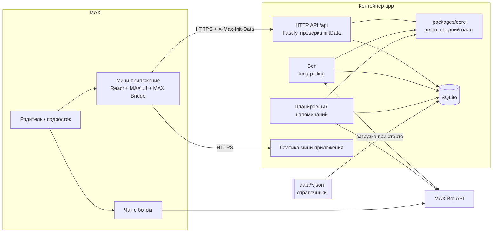

# После 9-го

Чат-бот и мини-приложение в MAX, которые помогают семье девятиклассника спланировать год и выбрать путь: 10 класс или колледж.

## Назначение

Родителю девятиклассника нужно выбрать между 10 классом и колледжем, не потеряв год. Важные сроки и правила разбросаны по разным источникам: предметы ОГЭ выбирают до 1 марта, в колледж поступают по среднему баллу аттестата, документы принимают с 20 июня, а оригинал аттестата отдают только в один колледж. Семья часто узнаёт о них слишком поздно.

«После 9-го» собирает всё это в одном месте внутри MAX:

- годовой план 9 класса с датами под регион и выбранный путь, напоминания в чате с ботом;
- сравнение двух путей: 10–11 класс и колледж;
- калькулятор среднего балла аттестата с подсказкой, какие оценки ещё можно подтянуть;
- колледжи региона с прошлогодними проходными баллами, источником и датой проверки;
- отправка плана подростку: он открывает план по ссылке и тоже получает напоминания;
- блок «Что дальше» с правилами перехода из колледжа в вуз.

Сервис не подаёт заявления, не рассчитывает шансы на поступление и не заменяет официальные правила.

## Основной пользовательский сценарий

1. Родитель запускает бота и нажимает «Начать».
2. Бот задаёт 5 вопросов кнопками: регион, город, класс, интересы подростка, к какому пути склоняется семья.
3. Бот присылает итог, ближайшие даты плана прямо в чате и кнопку «Открыть план». План текстом доступен и без мини-приложения — командой `/plan` и кнопкой «Все даты года».
4. В мини-приложении родитель сравнивает два пути, считает средний балл, смотрит колледжи и добавляет программы в избранное.
5. На экране «Мой план» родитель видит даты года, отмечает выполненное и нажимает «Отправить план подростку» — открывается выбор чата в MAX.
6. Подросток открывает ссылку, видит тот же план и включает напоминания.
7. К ключевым датам бот присылает напоминания обоим в 10:00 по времени региона.

## Состав и архитектура



| Компонент | Путь | Что делает |
|---|---|---|
| Доменная логика | `packages/core` | расчёт среднего балла аттестата, построение плана под регион и путь, расписание напоминаний. Используется и сервером, и мини-приложением |
| Сервер | `apps/server` | один процесс Node.js: HTTP API мини-приложения, бот MAX (опрос, команды), планировщик напоминаний, раздача статики мини-приложения |
| Мини-приложение | `apps/miniapp` | React 19, MAX UI, MAX Bridge. Экраны: онбординг, «Два пути», «Средний балл», «Колледжи» со сравнением избранных программ, «Мой план», «Что дальше», план по ссылке |
| Справочники | `data` | регионы, специальности, колледжи, ключевые даты, тексты. Загружаются в базу при старте |
| Документация | `docs` | [описание API (OpenAPI 3.1)](docs/openapi.yaml), [план разработки](docs/development-plan.md) |

Внутри сервера код разделён по слоям: `api` (маршруты и проверка подписи), `bot` (диалог), `scheduler` (напоминания), `services` (сценарии), `repositories` (SQL), `db` (миграции и загрузка справочников). Зависимости собираются в `src/container.js`.

**Модель данных.** Справочники: `regions`, `interests`, `specialties`, `colleges`, `college_specialty` (программа колледжа с проходным баллом, годом, источником и датой проверки), `key_dates`. Пользовательские данные: `users` (только ID пользователя в MAX и ответы опроса), `plans`, `plan_item_states`, `plan_followers`, `favorites`, `reminders`. Схема — в [001_init.sql](apps/server/src/db/migrations/001_init.sql).

## Запуск одной командой

Нужны Docker и Docker Compose v2.24+.

```bash
cp .env.example .env
docker compose up --build
```

В `.env` укажите `BOT_TOKEN`. Без токена можно проверить сборку и статику: поставьте `BOT_ENABLED=false`, тогда бот не запускается, а личные разделы API отвечают 401.

После запуска:

- мини-приложение и API — `http://localhost:8080`;
- проверка работоспособности — `http://localhost:8080/api/health`.

### Публикация по HTTPS для MAX

MAX открывает мини-приложение только по HTTPS. На сервере с доменом, направленным на него, и открытыми портами 80 и 443:

```bash
# в .env: DOMAIN=posle9.example.ru
docker compose --profile https up --build -d
```

Caddy получит сертификат и будет проксировать запросы в контейнер `app`. Собственный домен не обязателен: подойдёт адрес вида `<ip-через-дефисы>.sslip.io` или адрес, который выдаёт хостинг.

**Подключение мини-приложения к боту.** Бота выдают организаторы хакатона, у команды есть только токен, без доступа к «MAX для партнёров» и административным настройкам. Публичную HTTPS-ссылку мини-приложения (`https://<DOMAIN>/`) отправляют организаторам через форму, привязку к боту делают они. Пока привязки нет, кнопка «Открыть план» в боте не работает, но план доступен в чате командой `/plan`.

Никнейм выданного бота сервер получает из Bot API при старте. Узнать его вручную:

```bash
curl -H "Authorization: <BOT_TOKEN>" https://platform-api2.max.ru/me
```

## Переменные окружения

| Переменная | Обязательна | По умолчанию | Назначение |
|---|---|---|---|
| `BOT_TOKEN` | да, если `BOT_ENABLED=true` | — | токен бота, выданного организаторами. Нужен и боту, и для проверки подписи мини-приложения |
| `BOT_ENABLED` | нет | `true` | запускать бота и планировщик напоминаний |
| `BOT_USERNAME` | нет | из Bot API | никнейм бота для ссылок `https://max.ru/<бот>?startapp=…` |
| `HOST` | нет | `0.0.0.0` | адрес HTTP-сервера |
| `PORT` | нет | `8080` | порт HTTP-сервера. В Docker внутри контейнера всегда 8080 |
| `APP_PORT` | нет | `8080` | порт на хосте для `docker compose` |
| `DOMAIN` | для профиля `https` | `localhost` | домен для HTTPS-прокси Caddy |
| `DATABASE_PATH` | нет | `./storage/posle9.sqlite` | файл базы SQLite. В Docker — том `storage` |
| `ACADEMIC_YEAR` | нет | по текущей дате | учебный год плана, например `2026/2027` |
| `REMINDER_INTERVAL_SECONDS` | нет | `300` | как часто проверять наступившие напоминания |
| `INIT_DATA_MAX_AGE_SECONDS` | нет | `86400` | срок действия подписи данных запуска мини-приложения |
| `ADMIN_USER_IDS` | нет | — | ID пользователей MAX через запятую, которым доступна команда `/stats`. Свой ID бот пишет в ответ на `/stats` |
| `RATE_LIMIT_PER_MINUTE` | нет | `300` | сколько запросов к API в минуту разрешено с одного IP, сверх — 429 с `Retry-After`. `/api/health` не ограничивается. `0` — без ограничения |
| `AUTH_DEV_BYPASS` | нет | `false` | только для локальной разработки: принимать заголовок `X-Dev-User-Id`. При `NODE_ENV=production` игнорируется |
| `LOG_LEVEL` | нет | `info` | уровень логов |

Шаблон без секретов — [.env.example](.env.example). Файл `.env` в репозиторий не попадает.

## Порты

| Порт | Где | Что |
|---|---|---|
| 8080 | контейнер `app` (на хосте — `APP_PORT`) | HTTP: мини-приложение `/` и API `/api` |
| 80, 443 | контейнер `caddy`, только профиль `https` | HTTPS-прокси к `app` |
| 5173 | только локальная разработка | dev-сервер Vite |

## Зависимости

- **Среда выполнения:** Node.js 24 (используется встроенный модуль `node:sqlite`), образ `node:24-alpine`. Для HTTPS — образ `caddy:2-alpine`.
- **Сервер:** `fastify` 5.12.5, `@fastify/static` 10.1.3, `@maxhub/max-bot-api` 0.3.1.
- **Мини-приложение:** `react` и `react-dom` 19.2.8, `@maxhub/max-ui` 0.5.0; сборка — `vite` 8.3.0, `@vitejs/plugin-react` 6.1.1. MAX Bridge подключается скриптом `https://st.max.ru/js/max-web-app.js`.
- Версии зафиксированы в `package.json` и [package-lock.json](package-lock.json).

## Внешние сервисы и интеграции

| Сервис | Как используется | Статус |
|---|---|---|
| MAX Bot API | бот: опрос, команды, кнопка открытия мини-приложения, отправка напоминаний (long polling) | реальная интеграция, нужен `BOT_TOKEN` |
| MAX Bridge | проверка подписи `initData`, кнопка «Назад», внешние ссылки, отправка плана в чаты MAX (`shareMaxContent`), тактильный отклик | реальная интеграция, работает внутри MAX |
| Сайты колледжей, Рособрнадзор, ФИПИ, Минобрнауки | источники фактов в справочниках, открываются по ссылкам | данные подготовлены заранее, **не автоматическая интеграция** |
| Let's Encrypt через Caddy | сертификат для HTTPS | только профиль `https` |

Интеграций с Госуслугами, «Моей школой» и системами колледжей нет. Данные колледжей и дат подготовлены заранее вручную.

## Работа с данными

- **Персональные данные.** Сервер хранит только ID пользователя в MAX, ответы опроса (регион, город, класс, интересы, путь), отметки плана, избранное и расписание напоминаний. Имя ребёнка не спрашивается. Оценки для калькулятора среднего балла сохраняются только на устройстве (`localStorage`) и на сервер не отправляются.
- **Удаление данных.** Пользователь удаляет всё о себе командой `/delete_data` в боте (с подтверждением) или методом `DELETE /api/profile`: профиль, план, отметки, избранное, подписки и напоминания удаляются, в журнале событий ID обнуляется. Ссылку на план можно отозвать (`DELETE /api/plan/share`): старая ссылка перестаёт открываться, подписчики отключаются.
- **Проверка пользователя.** Личные методы API принимают только подписанные MAX данные запуска (`X-Max-Init-Data`, HMAC-SHA256 с токеном бота) со сроком действия.
- **Справочники.** Файлы `data/*.json` проверяются валидатором и синхронизируются с базой при каждом старте: новые записи добавляются, изменённые обновляются, удалённые удаляются. У каждого факта есть ссылка на источник и дата проверки. Если даты нет, в интерфейсе показывается «не проверено».
- **Хранение.** SQLite в режиме WAL, файл в томе `storage`. Миграции применяются автоматически.

## Тестовые данные

**Пилотный регион — Республика Татарстан, реальные данные** (`isDemo: false`): 10 колледжей Казани, 35 программ, правила эксперимента с двумя ОГЭ и региональные даты. У каждой программы есть источник и дата проверки 16.09.2026; незаполненные поля показываются как «нет данных». Демо-регионы (`isDemo: true`) оставлены для сценария проверки и тестов: названия, адреса, проходные баллы и количество мест в них вымышлены, в интерфейсе они помечены «демо-данные». Подробности, источники и пробелы в данных — в [data/README.md](data/README.md).

- «Республика Татарстан» — реальные данные пилотного региона, эксперимент с двумя ОГЭ.
- «Демо-регион А» — обычный регион: 12 колледжей в двух городах.
- «Демо-регион Б (эксперимент с двумя ОГЭ)» — показывает, как меняются план и калькулятор в регионе эксперимента.
- Ключевые даты 2026/2027 учебного года: федеральные (со ссылками на Рособрнадзор, ФИПИ и порядок приёма в СПО), региональные (демо) и рекомендации сервиса.

Проверить файлы после правок:

```bash
npm run data:check
```

Отдельные тестовые учётные записи не нужны: любой пользователь MAX, открывший бота, получает свой профиль.

## Пошаговый сценарий проверки

### В MAX

1. Откройте бота по ссылке, нажмите «Начать».
2. Выберите «Демо-регион А» → «Демоград» → «9 класс» → «IT и программирование» → «Готово» → «Колледж».
3. **Ожидается:** сообщение «Готово! План собран» со сводкой ответов, тремя ближайшими датами плана и кнопками «Открыть план», «Все даты года», «Выключить напоминания», «Изменить ответы».
4. Нажмите «Открыть план». **Ожидается:** экран «Два пути» с отметкой «ваш выбор» на карточке колледжа.
5. «Балл»: отметьте несколько оценок. **Ожидается:** средний балл пересчитывается сразу, для предметов ОГЭ появляется строка оценки за экзамен, ниже — какие оценки ещё можно подтянуть.
6. «Колледжи»: фильтры уже выставлены по ответам. Откройте колледж, нажмите ☆ у программы. **Ожидается:** звезда закрашивается, программа появляется в разделе «Избранное».
   Добавьте ещё одну программу и нажмите «Сравнить рядом». **Ожидается:** таблица с программами в столбцах: форма, срок, бюджетные места, проходной балл, испытания, общежитие, источник; переключатель «Только различия» скрывает совпадающие строки.
7. «Мой план»: отметьте пункт выполненным. **Ожидается:** пункт зачёркнут, счётчик «выполнено» увеличился.
8. Нажмите «Отправить план подростку». **Ожидается:** экран выбора чата MAX с текстом и ссылкой `https://max.ru/<бот>?startapp=plan_…`.
9. С другого аккаунта откройте ссылку. **Ожидается:** «План после 9 класса» только для чтения, кнопка «Получать напоминания». После нажатия — «Готово! Напоминания придут в чат с ботом».
10. Команда `/test_reminder` в боте. **Ожидается:** пример напоминания по ближайшему пункту плана с кнопкой «Открыть план». Настоящие напоминания приходят сами к датам; логика отправки покрыта тестом `apps/server/test/reminders.test.js`.
11. Команда `/reminders`. **Ожидается:** «Напоминания выключены», повторно — «включены».
12. Команда `/plan`. **Ожидается:** ближайшие 5 дат плана текстом с отметкой «через N дн.» и кнопкой «Все даты года» — план доступен и без мини-приложения.

### Без MAX

```bash
curl http://localhost:8080/api/health
# {"status":"ok","bot":"running","academicYear":"2026/2027"}

curl "http://localhost:8080/api/colleges?regionId=demo-standard&interests=it&city=Демоград"
# {"colleges":[{"id":"demo-it-college","name":"Демо-колледж информационных технологий",...}]}

curl http://localhost:8080/api/plan
# 401 {"error":{"code":"unauthorized","message":"Откройте мини-приложение из чата с ботом в MAX"}}
```

Те же проверки для технической оценки описаны в [DATA-API.yaml](DATA-API.yaml) (формат DATA-API 1.0). Проверить файл валидатором организаторов:

```bash
python validate_data_api.py /path/to/DATA-API.yaml --schema /path/to/DATA-API.schema.json
```

## Примеры ожидаемого поведения

| Ситуация | Поведение |
|---|---|
| Мини-приложение открыто не из MAX | «Откройте мини-приложение из чата с ботом в MAX» и кнопка «Повторить» |
| Мини-приложение долго было открыто, подпись устарела | «Сессия устарела. Закройте и снова откройте мини-приложение» |
| Профиль не заполнен | мини-приложение показывает онбординг из 5 вопросов, API плана отвечает 409 `profile_incomplete` |
| Нет сети | «Нет соединения. Проверьте интернет и попробуйте ещё раз» и кнопка «Повторить», введённые данные сохраняются |
| Фильтры колледжей ничего не нашли | «По этим фильтрам ничего не нашлось» и кнопка «Сбросить фильтры» |
| Регион в эксперименте с двумя ОГЭ | в плане пункт «Заявление на ОГЭ: два или четыре экзамена» — два достаточно для колледжа, для 10 класса нужны четыре; в калькуляторе предметы по выбору отмечаются, если подросток их сдаёт |
| Пользователь заблокировал бота | напоминание помечается как неотправленное, повторов нет |
| Сервер был выключен дольше суток | опоздавшие напоминания не отправляются задним числом |
| Нажата кнопка устаревшего или прерванного опроса | бот предлагает начать опрос заново |
| Ошибка при обработке сообщения в боте | «Что-то пошло не так. Попробуйте ещё раз или начните заново: /start», ошибка записывается в лог |
| Семья выбрала 8 класс | план строится на следующий учебный год (9 класс). Если его даты ещё не опубликованы, бот объясняет это, напоминания о датах текущих девятиклассников не ставятся |
| «Добавить в календарь» в мини-приложении | сервер выдаёт одноразовую ссылку на файл `.ics` (действует 10 минут), MAX скачивает файл, телефон предлагает добавить события: даты плана на весь день с напоминанием накануне в 9:00. По устаревшей ссылке — 410 «Ссылка на календарь устарела» |
| `/delete_data` в боте | объяснение, какие данные хранятся, кнопки «Да, удалить» и «Отмена»; после удаления — «Данные удалены», план и ссылка на него больше не работают |
| Родитель отозвал ссылку на план | подросток по старой ссылке видит «Ссылка на план недействительна», его напоминания по этому плану отключены |
| Обновлены даты в справочнике | при старте сервера и раз в сутки очередь напоминаний пересобирается под новые даты |
| MAX Bot API недоступен три проверки подряд (раз в 5 минут) | `/api/health` показывает `{"status":"degraded","bot":"unreachable",…}`, в логах ошибка; опрос MAX перезапускается автоматически, после восстановления статус снова `ok` |

## Известные ограничения

- Реальные данные собраны только для Татарстана (Казань). Прошлогодние проходные баллы колледжи Татарстана почти не публикуют — у большинства программ балл «нет данных». Перечень колледжей эксперимента и расписание ОГЭ на 2027 год ещё не опубликованы.
- Расписание ОГЭ на 2027 год ещё не утверждено, поэтому основной период в плане ориентировочный. Остальные федеральные даты сверены с первоисточниками 16.09.2026 (`checkedAt`).
- Калькулятор следует порядку выдачи аттестатов (приказ Минпросвещения России № 546, ред. от 29.05.2026): итоговая по предметам ОГЭ — среднее годовой и экзаменационной с математическим округлением, по математике из трёх курсов — среднее годовых по алгебре, геометрии, вероятности и статистике и экзаменационной. Список предметов пользователь может изменить под свой аттестат.
- Отправка плана через `shareMaxContent` работает внутри MAX; в обычном браузере ссылка копируется в буфер обмена.
- Бот и планировщик работают в одном процессе с API. Для нескольких экземпляров нужна общая база и блокировка задач напоминаний.
- Ограничение частоты запросов хранится в памяти процесса и сбрасывается при перезапуске.
- Модуль `node:sqlite` в Node.js 24 помечен как экспериментальный.

## Остановка и повторный запуск

```bash
docker compose down          # остановить, данные в томе storage сохраняются
docker compose up -d         # запустить снова
docker compose up --build -d # пересобрать после изменений кода или данных
docker compose logs -f app   # логи
docker compose down -v       # остановить и удалить данные (том storage)
```

### Метрики пилота

Сервер записывает события основного сценария: начало и завершение опроса, просмотр плана в чате, открытие мини-приложения (и откуда: кнопка бота, напоминание, ссылка на чужой план), открытие плана по ссылке, подписка подростка, отметки, избранное, скачивание календаря, отправленные напоминания. Хранятся только название события, ID пользователя в MAX и обезличенные свойства — регион, путь, источник.

Отчёт за всё время и за 7 дней — командой `/stats` в боте (для `ADMIN_USER_IDS`) или на сервере:

```bash
docker compose exec app node --disable-warning=ExperimentalWarning apps/server/src/scripts/stats.js
```

### Резервная копия базы

Скрипт [scripts/backup-db.sh](scripts/backup-db.sh) делает согласованную копию SQLite из работающего контейнера и хранит 14 последних копий в папке `backups/`:

```bash
./scripts/backup-db.sh
```

На сервере он запускается раз в сутки через cron — строка для `crontab -e` есть в начале скрипта.

Восстановление из копии (сервис будет недоступен около минуты):

```bash
docker compose stop app
docker compose run --rm --no-deps app sh -c "rm -f /app/storage/posle9.sqlite-wal /app/storage/posle9.sqlite-shm"
docker compose cp backups/posle9-<дата>.sqlite app:/app/storage/posle9.sqlite
docker compose start app
```

## Сдача решения

- Сдача — до 30 сентября 2026 года, 12:00 МСК, в личном кабинете. После дедлайна переданная версия не изменяется.
- Развёрнутый сервис работает весь период проверки и соответствует сданному коммиту. После сдачи сервер не обновляется.
- Вместе со ссылкой на репозиторий передаётся архив исходного кода зафиксированного коммита и его контрольная сумма:

Проще всего — скриптом: он прогоняет тесты и проверку справочников, собирает архив зафиксированного коммита в папку `submission/` и печатает commit hash и SHA-256 для первого слайда:

```bash
./scripts/make-submission.sh
```

Вручную:

```bash
git archive --format=zip --prefix=posle9/ -o posle9-$(git rev-parse --short HEAD).zip HEAD
```

```bash
sha256sum posle9-*.zip
```

  В Windows вместо `sha256sum`: `Get-FileHash posle9-*.zip -Algorithm SHA256` в PowerShell.

## Разработка

Нужен Node.js 24 или новее.

```bash
npm install
cp .env.example .env
npm test              # тесты ядра и сервера
npm run data:check    # проверка справочников
npm run dev:server    # сервер с перезапуском при изменениях
npm run dev:miniapp   # мини-приложение на http://localhost:5173, /api проксируется на 8080
```

На каждый pull request и push в `main` GitHub Actions ([.github/workflows/ci.yml](.github/workflows/ci.yml)) запускает тесты, проверку справочников и сборку мини-приложения, собирает Docker-образ с замером времени (проверка падает, если сборка дольше 5 минут без учёта загрузки базовых образов), запускает контейнер и проверяет открытые методы API.

Без токена бота: в `.env` поставьте `BOT_ENABLED=false` и `AUTH_DEV_BYPASS=true`. Для мини-приложения вне MAX создайте `apps/miniapp/.env.development.local` со строкой `VITE_DEV_USER_ID=100`. Другого пользователя и открытие плана по ссылке можно проверить через адрес `?devUser=200&startapp=plan_<токен>`. В обычной сборке (`npm run build`) эти параметры не работают.

## Материалы команды

- [План разработки](docs/development-plan.md)
- [Сценарий интервью с родителями](docs/interview-guide.md)
- [Чек-лист проверки в MAX и журнал проблем](docs/max-check.md)
- [Сценарий пилота](docs/pilot-scenario.md)
- [Разбор кода перед защитой](docs/code-tour.md) — маршрут по коду и вероятные вопросы жюри
- [Чек-лист сдачи](docs/submission-checklist.md) — заморозка 29.09 и соответствие требованиям кейса
- [DATA-API.yaml](DATA-API.yaml) — обязательные HTTP-проверки API для технической оценки, формат DATA-API 1.0
- [Презентация](docs/presentation/presentation.pdf) и [инструкция по обновлению](docs/presentation/README.md)
